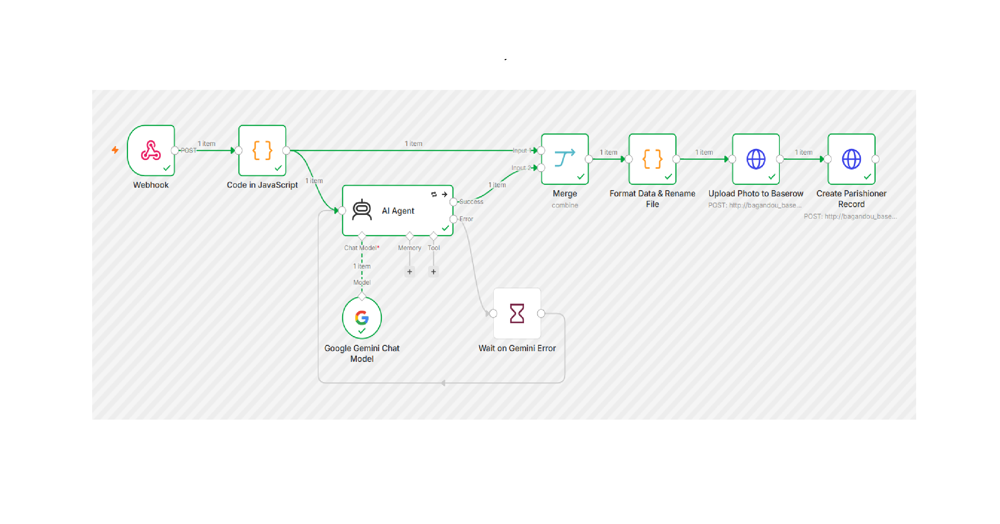

# Autonomous Docker/Edge Stack for CAR Mission (Bagandou)

<p align="center">
  
</p>

[PL] Polska wersja opisu znajduje się w dolnej części tego dokumentu.

This repository contains a unified, production-ready Infrastructure as Code (IaC) configuration template designed to deploy a decentralized application stack for a humanitarian mission in the Central African Republic (CAR).

## 🚀 Architecture Overview
The environment is structured using localized Bind Mounts (`./dane_*`) to ensure 100% data portability, simple backups, and zero-maintenance compatibility with **Edge Computing** nodes, specifically optimized for **Raspberry Pi 5** deployments in off-grid/low-bandwidth remote areas.

### App Stack Components:
* **Baserow**: Local database & digital registry platform (parish records).
* **n8n & Google Gemini AI**: Multimodal OCR and workflow automation pipeline. Processes scanned card photos via AI, automatically cleans up handwriting artifacts (handling dates and line padding), renames assets to `Karta_[Number].jpg`, and ingests clean records straight into Baserow.
* **Cloudflared / Ngrok**: Secure Ingress Tunnels for mobile data ingestion without public IP exposure.
* **Homepage (Nginx)**: Lightweight, offline landing page dashboard (`homer-assets`) for local operators.
* **Uptime Kuma & Power Watchdog**: Network monitoring and local power line status tracking via hardware scripts (`straznik_ups.sh`).
* **Umami & PostgreSQL**: Lightweight, privacy-focused analytics engine and backend database.
* **Stirling-PDF & CUPS**: Self-hosted document processing, multimodal OCR, and local print server management.

## 🛠️ Deployment Strategy

1. Clone this repository to your target Edge Device (Raspberry Pi 5).
2. Create your local environment file from the secure template:
   ```bash
   cp .env.example .env
   ```
3. Populate `.env` with your secure credentials and Cloudflare/Ngrok tokens.
4. To deploy the tailored Raspberry Pi 5 production stack, execute:
   ```bash
   docker compose -f docker-compose.rpi.yml up -d
   ```

*Note: Data persistence directories (`./dane_baserow`, `./dane_n8n`, etc.) are explicitly ignored via `.gitignore` to maintain strict data privacy and security.*

## 💾 Data Migration, Workflow & Schema Replication

Since persistence directories are explicitly ignored by version control to maintain data privacy, you can replicate either your entire verified database via hardware storage or import templates directly through version-controlled structural files (`baserow_schema.json` and `workflow_bagandou.json`).

### 1. Exporting the Source Stack Data (On WSL2/Host)
Before copying, bring down the active containers to safely close all database locks, then compress the live data volume:
```bash
# Shutdown the local containers cleanly
docker compose down

# Create a compressed archive of your active Baserow data directory
tar -czvf baserow_production_backup.tar.gz dane_baserow/
```
Copy `baserow_production_backup.tar.gz` and your secure `.env` file to your USB drive.

### 2. Importing and Deploying (On Raspberry Pi 5)
Once the target Edge hardware is initialized and this repository is cloned:
```bash
# Navigate to your cloned repository folder on the RPi
cd bagandou-baserow

# Transfer the tar.gz file from the USB drive to this directory, then extract it:
tar -xzvf baserow_production_backup.tar.gz

# Recreate your local environment file and fill in production secrets/tokens
cp .env.example .env
nano .env

# Deploy the tailored production environment with pre-loaded database structures
docker compose -f docker-compose.rpi.yml up -d
```

### 3. Structural & Automation Imports (No Data)
- **n8n Workflow**: Import `workflow_bagandou.json` directly through the n8n UI (*Import from file...*) and attach your local Gemini and Baserow credentials.
- **Baserow Schema**: To rebuild the structural workspace (Workspace 73: "Kancelaria parafialna") and all its table column configurations without records, import `baserow_schema.json` inside the container:
  ```bash
  docker compose exec -T baserow ./baserow.sh backend-cmd manage import_workspace_applications 73 ./baserow_schema.json
  ```

---

# Autonomiczny Stack Docker/Edge dla Misji w RCA (Bagandou)

To repozytorium zawiera ujednolicony, gotowy do wdrożenia produkcyjnego szablon konfiguracji Jako Kod (IaC). Służy on do uruchomienia zdecentralizowanego systemu aplikacji na potrzeby misji humanitarnej w Republice Środkowoafrykańskiej (RCA).

## 🚀 Przegląd Architektury
Środowisko oparte jest na lokalnych punktach montowania folderów (`./dane_*`), co gwarantuje 100% przenośności danych, prostotę tworzenia kopii zapasowych oraz bezobsługowe działanie na urządzeniach infrastruktury brzegowej (**Edge Computing**). Całość została zoptymalizowana pod kątem **Raspberry Pi 5** pracującego w rejonach pozbawionych stałego dostępu do sieci i stabilnego zasilania.

### Komponenty systemu:
* **Baserow**: Lokalna baza danych i cyfrowy rejestr kancelarii parafialnej.
* **n8n & Google Gemini AI**: Multimodalne przetwarzanie OCR i automatyzacja. Przepływ odbiera zdjęcia kart, przesyła je do analizy pismem odręcznym przez AI, automatycznie koryguje powtarzalne błędy zapisu (np. poprawa formatu dat czy wycięcie szumów linii pomocniczych z nazwisk), nadaje plikom strukturę `Karta_[Numer].jpg` i zapisuje czyste rekordy w Baserow.
* **Cloudflared / Ngrok**: Bezpieczne tunele sieciowe do odbierania formularzy z telefonów bez wystawiania publicznego IP.
* **Homepage (Nginx)**: Lekki panel startowy offline (`homer-assets`) dla lokalnych operatorów.
* **Uptime Kuma & Strażnik zasilania**: Monitorowanie sieci i stanu miejskiej sieci elektrycznej za pomocą skryptów sprzętowych (`straznik_ups.sh`).
* **Umami & PostgreSQL**: Prywatny, lekki silnik analityczny oraz wewnętrzna baza danych statystyk.
* **Stirling-PDF & CUPS**: Samodzielny serwer edycji dokumentów, moduł OCR oraz centralny serwer wydruków.

## 🛠️ Strategia Wdrożenia

1. Skonuj to repozytorium na docelowe urządzenie (Raspberry Pi 5).
2. Stwórz lokalny plik zmiennych środowiskowych z bezpiecznego szablonu:
   ```bash
   cp .env.example .env
   ```
3. Uzupełnij plik `.env` swoimi tajnymi hasłami oraz tokenami Cloudflare/Ngrok.
4. Aby uruchomić stack produkcyjny dopasowany do Raspberry Pi 5, wykonaj:
   ```bash
   docker compose -f docker-compose.rpi.yml up -d
   ```

*Uwaga: Foldery przechowywania danych (`./dane_baserow`, `./dane_n8n` itp.) are celowo ignorowane przez plik `.gitignore` w celu zachowania pełnej prywatności danych i cyberbezpieczeństwa.*

## 💾 Migracja, Automatyzacja i Odtwarzanie Struktur

Ponieważ katalogi z danymi produkcyjnymi są zablokowane przed wysyłką na GitHub, możesz odtworzyć system na Malince za pomocą fizycznego nośnika lub zaimportować gotowe schematy bez danych z repozytorium (`baserow_schema.json` oraz `workflow_bagandou.json`).

### 1. Eksportowanie danych (Na WSL2 / Komputerze testowym)
Przed kopiowaniem wyłącz kontenery, aby bezpiecznie zamknąć i zapisać pliki bazy danych, a następnie spakuj folder:
```bash
# Bezpieczne zatrzymanie lokalnych kontenerów
docker compose down

# Stworzenie skompresowanego archiwum aktywnego katalogu Baserow
tar -czvf baserow_production_backup.tar.gz dane_baserow/
```
Skopiuj plik `baserow_production_backup.tar.gz` oraz swój ukryty plik `.env` na pendrive'a.

### 2. Importowanie i Uruchomienie (Na Raspberry Pi 5)
Gdy uruchomisz system operacyjny na Malince i sklonujesz to repozytorium:
```bash
# Wejdź do folderu sklonowanego projektu
cd bagandou-baserow

# Przenieś plik tar.gz z pendrive'a do tego katalogu i rozpakuj go:
tar -xzvf baserow_production_backup.tar.gz

# Przygotuj produkcyjny plik .env i wpisz tam właściwe hasła/tokeny
cp .env.example .env
nano .env

# Uruchom zoptymalizowany pod Malinę stack z wczytaną już strukturą bazy danych
docker compose -f docker-compose.rpi.yml up -d
```

### 3. Odtwarzanie szablonów automatyzacji (Bez danych)
- **Przepływ n8n**: Zaimportuj plik `workflow_bagandou.json` bezpośrednio w panelu n8n (*Import from file...*) i podepnij pod klocki swoje własne dane uwierzytelniające (credentials).
- **Schemat Baserow**: Aby odbudować strukturę przestrzeni roboczej (Workspace 73: "Kancelaria parafialna") i konfigurację kolumn tabeli bez rekordów, zaimportuj plik `baserow_schema.json` wewnątrz kontenera:
  ```bash
  docker compose exec -T baserow ./baserow.sh backend-cmd manage import_workspace_applications 73 ./baserow_schema.json
  ```
