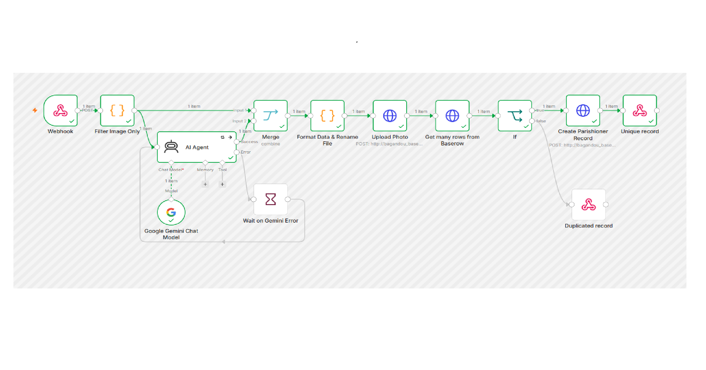

# Autonomous Docker/Edge Stack for CAR Mission (Bagandou)

<p align="center">
  
</p>

[PL] Polska wersja opisu znajduje się w dolnej części tego dokumentu.

This repository contains a unified, production-ready Infrastructure as Code (IaC) configuration template designed to deploy a decentralized application stack for a humanitarian mission in the Central African Republic (CAR).

## 🚀 Architecture Overview
The environment is structured using localized Bind Mounts (`./dane_*`) to ensure 100% data portability, simple backups, and zero-maintenance compatibility with Windows, Linux, and Edge nodes. It features a dual-compose architecture tailored for standard PC/laptop architectures and remote ARM hardware.

### App Stack Components:
* **ODK Collect Ultra-Lightweight Form (`formularz_odk.xml`)**: Optimized for off-grid operations. It presents a minimalist interface featuring a single, required binary upload element. Field operators capture raw paper card photos (either directly via camera or loaded from local storage) while enforcing hardware-level compression (`odk:max-pixels="2048"`) on the smartphone to protect bandwidth and remote server memory.
* **n8n & Google Gemini AI**: Multimodal OCR and automated orchestration engine. It receives the multipart ODK form data, extracts the raw image asset, and routes it to Gemini. The AI cleans up handwriting artifacts (standardizing dates, removing line noise), renames the asset to `Karta_[Number].jpg`, and updates Baserow by uploading **both** the processed image file and its corresponding structured text records.
* **Baserow**: Local database, digital registry, and asset store. Serves as the central repository for parish records, storing both structured fields and binary card attachments.
* **Network Tunnels (Dual-Ingress Strategy)**:
  * **Ngrok (Staging/WSL2)**: Used exclusively for rapid local testing and development on Windows laptops. Generates quick, ephemeral HTTPS URLs without requiring domain ownership to inspect incoming webhooks from ODK.
  * **Cloudflared (Production/RPi5)**: Used for long-term remote deployments on-site. It establishes a permanent, production-grade Cloudflare Tunnel bound to a custom domain. Free forever, persistent across reboots, and shielded by Cloudflare's DDoS protection.
* **Homepage (Nginx)**: Lightweight, offline landing page dashboard (`homer-assets`) for local operators.
* **Uptime Kuma & Power Watchdog**: Network monitoring and local power line status tracking via hardware scripts (`straznik_ups.sh`).
* **Umami & PostgreSQL**: Lightweight, privacy-focused analytics engine and backend database.
* **Stirling-PDF & CUPS**: Self-hosted document processing, multimodal OCR, and local print server management.

## 🛠️ Deployment Strategy

1. Clone this repository to your target device.
2. Create your local environment file from the secure template:
   ```bash
   cp .env.example .env
   ```
3. Populate `.env` with your secure credentials and Cloudflare/Ngrok tokens.
4. Deploy the stack based on your available hardware and environment:

   * **For Windows PC / Laptops (via WSL2) or standard Linux Hosts (x86_64):**
     *Use this option if you don't have a Raspberry Pi and want to run or test the full stack on a standard computer using Ngrok.*
     ```bash
     docker compose up -d
     ```
   * **For Remote Edge Deployment (Raspberry Pi 5 / ARM64):**
     *Use this option for hardware deployment on site using the secure Cloudflare Tunnel.*
     ```bash
     docker compose -f docker-compose.rpi.yml up -d
     ```

*Note: Data persistence directories (`./dane_baserow`, `./dane_n8n`, etc.) are explicitly ignored via `.gitignore` to maintain strict data privacy and security.*

## 💾 Data Migration, Workflow & Schema Replication

Since persistence directories are explicitly ignored by version control to maintain data privacy, you can replicate either your entire verified database via hardware storage or import templates directly through version-controlled structural files (`struktura_baserow.sql` and `n8n_workflow.json`).

### 1. Exporting the Source Stack Data (On WSL2/Host)
Before copying, bring down the active staging containers to safely close all database locks, then compress the live data volume:
```bash
# Shutdown the local testing containers cleanly
docker compose down

# Create a compressed archive of your active Baserow data directory
tar -czvf baserow_production_backup.tar.gz dane_baserow/
```
Copy `baserow_production_backup.tar.gz` and your secure `.env` file to your USB drive.

### 2. Importing and Deploying (On Raspberry Pi 5)
Once the target Edge hardware is initialized and this repository is cloned:
```bash
# Navigate to your cloned repository folder on the RPi
cd bagandou-baserow

# Transfer the tar.gz file from the USB drive to this directory, then extract it:
tar -xzvf baserow_production_backup.tar.gz

# Recreate your local environment file and fill in production secrets/tokens
cp .env.example .env
nano .env

# Deploy the tailored production environment on the RPi 5 hardware
docker compose -f docker-compose.rpi.yml up -d
```

### 3. Structural & Automation Imports (No Data)
- **n8n Workflow**: Import `n8n_workflow.json` directly through the n8n UI (*Import from file...*) and attach your local Gemini and Baserow credentials.
- **Baserow Schema**: To rebuild the structural workspace configurations without records, import the clean SQL structure file inside the container:
  * **On WSL2 / Windows PC:**
    ```bash
    docker compose exec -T postgres psql -U baserow -d baserow < struktura_baserow.sql
    ```
  * **On RPi 5:**
    ```bash
    docker compose -f docker-compose.rpi.yml exec -T postgres psql -U baserow -d baserow < struktura_baserow.sql
    ```

---
# Autonomiczny Stack Docker/Edge dla Misji w RCA (Bagandou)

<p align="center">
  
</p>

[EN] The English version of the description can be found at the top of this document.

To repozytorium zawiera ujednolicony, gotowy do wdrożenia produkcyjnego szablon konfiguracji Jako Kod (IaC). Służy on do uruchomienia zdecentralizowanego systemu aplikacji na potrzeby misji humanitarnej w Republice Środkowoafrykańskiej (RCA).

## 🚀 Przegląd Architektury
Środowisko oparte jest na lokalnych punktach montowania folderów (`./dane_*`), co gwarantuje 100% przenośności danych, prostotę tworzenia kopii zapasowych os wejściowych oraz bezobsługowe działanie. Architektura wspiera podwójną konfigurację Docker Compose dostosowaną zarówno do standardowych komputerów/laptopów, jak i dedykowanego sprzętu brzegowego.

### Komponenty systemu:
* **Lekki Formularz ODK (`formularz_odk.xml`)**: Ekstremalnie uproszczony punkt wejściowy danych dla smartfonów terenowych. Posiada jedno wymagane (`required="true()"`) pole binarne. Interfejs aplikacji mobilnej ODK Collect automatycznie pozwala operatorowi wykonać zdjęcie papierowej karty beneficjenta aparatem lub załadować gotowy plik z galerii urządzenia. Formularz wymusza sprzętową kompresję obrazu do bezpiecznej rozdzielczości (`odk:max-pixels="2048"`), co minimalizuje zużycie sieci i odciąża procesor n8n na Raspberry Pi 5.
* **n8n & Google Gemini AI**: Silnik automatyzacji i multimodalnego przetwarzania OCR. Przepływ odbiera pakiet danych `multipart/form-data` z ODK, wyciąga z niego plik graficzny i przekazuje do analizy przez AI. Gemini koryguje pismo odręczne (formatuje daty, usuwa szumy linii pomocniczych), zmienia nazwę pliku na `Karta_[Number].jpg`, a następnie wysyła do Baserow **zarówno** wyodrębnione dane tekstowe do odpowiednich kolumn, jak i samo przetworzone zdjęcie jako załącznik.
* **Baserow**: Lokalna baza danych i cyfrowy rejestr kancelarii parafialnej. Przechowuje ustrukturyzowane rekordy mieszkańców wraz z powiązanymi plikami źródłowymi (skanami/zdjęciami kart).
* **Tunele Sieciowe (Strategia Dual-Ingress)**:
  * **Ngrok (Środowisko WSL2 / Testowe)**: Używany wyłącznie do szybkiego dewelopmentu i lokalnych testów na laptopach z systemem Windows. Pozwala natychmiast wygenerować tymczasowy adres HTTPS bez posiadania domeny, ułatwiając debugowanie webhooków z ODK.
  * **Cloudflared (Środowisko RPi5 / Produkcyjne)**: Używany na misji do stałego wystawienia usług. Tworzy stabilny, darmowy tunel Cloudflare podpięty pod własną domenę misji. Wstaje automatycznie po restarcie Malinki i jest chroniony przez filtry anty-DDoS Cloudflare.
* **Homepage (Nginx)**: Lekki panel startowy offline (`homer-assets`) dla lokalnych operatorów.
* **Uptime Kuma & Strażnik zasilania**: Monitorowanie sieci i stanu miejskiej sieci elektrycznej za pomocą skryptów sprzętowych (`straznik_ups.sh`).
* **Umami & PostgreSQL**: Prywatny, lekki silnik analityczny oraz wewnętrzna baza danych statystyk.
* **Stirling-PDF & CUPS**: Samodzielny serwer edycji dokumentów, moduł OCR oraz centralny serwer wydruków.

## 🛠️ Strategia Wdrożenia

1. Sklonuj to repozytorium na docelowe urządzenie.
2. Stwórz lokalny plik zmiennych środowiskowych z bezpiecznego szablonu:
   ```bash
   cp .env.example .env
   ```
3. Uzupełnij plik `.env` swoimi tajnymi hasłami oraz tokenami Cloudflare/Ngrok.
4. Uruchom stack w zależności od posiadanego sprzętu i środowiska:

   * **Wersja dla komputerów i laptopów z systemem Windows (przez WSL2) lub Linux (x86_64):**
     *Wybierz tę opcję, jeśli nie posiadasz Raspberry Pi i chcesz uruchomić, przetestować lub używać pełnego systemu na zwykłym komputerze z tunelem Ngrok.*
     ```bash
     docker compose up -d
     ```
   * **Wersja produkcyjna docelowa dla Raspberry Pi 5 (ARM64):**
     *Wybierz tę opcję przy docelowym wdrożeniu sprzętowym na miejscu z użyciem bezpiecznego tunelu Cloudflare.*
     ```bash
     docker compose -f docker-compose.rpi.yml up -d
     ```

*Uwaga: Foldery przechowywania danych (`./dane_baserow`, `./dane_n8n` itp.) są celowo ignorowane przez plik `.gitignore` w celu zachowania pełnej prywatności danych i cyberbezpieczeństwa.*

## 💾 Migracja, Automatyzacja i Odtwarzanie Struktur

Ponieważ katalogi z danymi produkcyjnymi są zablokowane przed wysyłką na GitHub, możesz odtworzyć system na Malince za pomocą fizycznego nośnika lub zaimportować gotowe schematy bez danych z repozytorium (`struktura_baserow.sql` oraz `n8n_workflow.json`).

### 1. Eksportowanie danych (Na WSL2 / Komputerze testowym)
Przed kopiowaniem wyłącz kontenery na komputerze, aby bezpiecznie zamknąć i zapisać pliki bazy danych, a następnie spakuj folder:
```bash
# Bezpieczne zatrzymanie kontenerów na laptopie/PC (Windows/WSL2)
docker compose down

# Stworzenie skompresowanego archiwum aktywnego katalogu Baserow
tar -czvf baserow_production_backup.tar.gz dane_baserow/
```
Skopiuj plik `baserow_production_backup.tar.gz` oraz swój ukryty plik `.env` na pendrive'a.

### 2. Importowanie i Uruchomienie (Na Raspberry Pi 5)
Gdy uruchomisz system operacyjny na Malince i sklonujesz to repozytorium:
```bash
# Wejdź do folderu sklonowanego projektu
cd bagandou-baserow

# Przenieś plik tar.gz z pendrive'a do tego katalogu i rozpakuj go:
tar -xzvf baserow_production_backup.tar.gz

# Przygotuj produkcyjny plik .env i wpisz tam właściwe hasła/tokeny
cp .env.example .env
nano .env

# Uruchom zoptymalizowany pod Malinę stack z wczytaną już strukturą bazy danych
docker compose -f docker-compose.rpi.yml up -d
```

### 3. Odtwarzanie szablonów automatyzacji (Bez danych)
- **Przepływ n8n**: Zaimportuj plik `n8n_workflow.json` bezpośrednio w panelu n8n (*Import from file...*) i podepnij pod klocki swoje własne dane uwierzytelniające (credentials).
- **Struktura Baserow**: Aby odbudować strukturę tabel bazy danych bez importowania starych rekordów, wykonaj odpowiednie polecenie w zależności od maszyny:
  * **Na komputerze z Windows/WSL2:**
    ```bash
    docker compose exec -T postgres psql -U baserow -d baserow < struktura_baserow.sql
    ```
  * **Na Raspberry Pi 5:**
    ```bash
    docker compose -f docker-compose.rpi.yml exec -T postgres psql -U baserow -d baserow < struktura_baserow.sql
    ```
